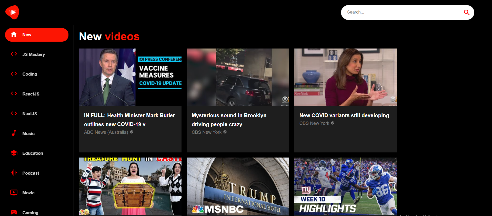

# VTube - Youtube Clone API Project

VTube is a Youtube Clone, which allows users to browse, search, and select videos from different categories. Also has a video player so they can watch the selected videos.

## Table of contents

- [Overview](#overview)
  - [The challenge](#the-challenge)
  - [Screenshot](#screenshot)
  - [Links](#links)
- [My process](#my-process)
  - [Built with](#built-with)

## Overview

### The challenge

Users should be able to:

- See the size of the elements adjust based on their device's screen size
- Search for videos
- Select videos from the categories in the sidebar
- Watch the selected videos

### Screenshot

### Links

- Solution URL: [https://github.com/Damjan15/VTube](https://github.com/Damjan15/VTube)
- Live Site URL: [https://v-tube-tau.vercel.app/](https://v-tube-tau.vercel.app/)

## My process

### Built with
- ReactJS
- MaterialUI
- RapidAPI Youtube API
- [Material UI](https://mui.com/)